# k8s-flow

A demo repository to play with Kubernetes and indent some more yaml

## Index

### 1.  **Premise**
- [x] Some considerations about Architecture :boom:
- [X] How i emulated a 3 tier network in my homelab
- [x] Architecture overview
### 2. **CI/CD**
- [x] Keep your code base clean :boom:
- [x] Build and deploy image locally :boom:
- [x] Create a pipeline to build image :boom:
- [x] Add security scan to image in pipeline :boom:
- [x] Optimize image size and security :boom:
- [x] Push image on a container registry :boom:

### 3. **Deploy**
- [x] Write Kubernetes manifest to deploy Deployment :star:
- [x] Add networking layer to our manifest :star:
- [x] Expose applications using Nginx Ingress Controller :star:
- [x] Expose RaspberryPi in DMZ :boom:
- [x] Add HPA :boom:
- [x] Replace our manifest with Helm chart :star:
- [ ] Add TLS/SSL Certificate to our application :boom:
- [x] GitOps flow using ArgoCD :boom:

### 4.**Scripting**
- [x] Create deploy-script :star:
- [ ] Write a golang application to export nginx logs at path /logs :star:

### 5. **Logging & Monitoring**
- [x] Prometheus/Grafana/ELK? TBD :boom:

### 6. **Load test & Autoscaling Considerations**
- [x] Load test with Locust to show autoscaling of pods :boom:

### 7. **External Access**
- [x] Grant external access to private subnet with VPN

___

## 1. Premise

### 1.1 **Some considerations about Architecture**


In a real scenario I would have created an architecture in the following way:

**Infrastructure Provisioning**
(I assume I am working on a cloud provider)
I would have used Terraform as an infrastructure as code tool and would have deployed the following resources:
- 3 Tier Network (Public, Private and DB subnet)
- Kubernetes Cluster
- Image Repository for every container image
- Possible pipelines according to the cloud provider
- Management users
- Application Load Balancer to expose Kubernetes application (via Nginx Ingress Controller)
- Possible DBs if the choice fell on DBs managed by the cloud provider


Here you can see an example of how I manage terraform repositories -> [Pesonal Website Iac ](https://github.com/ettoreciarcia/personal-website-iac)
And here -> [an article](https://ettoreciarcia.com/posts/01-iac-and-pipeline-my-personal-website/) on how I manage pipelines for IaC and an example of how I manage Terraform state

### 1.2 **How i emulated a 3 minus 1 tier network in my homelab**

In my homelab I tend to apply the same best practices as when I work in the Cloud.
But how can I achieve certain goals with such limited hardware as that of my homelab?

- **Public subnet** : The public subnet is the one that can be reached from outside in the cloud. Inside it contains any load balancers, NAT Gateway/Instance, VPN servers and everything that typically needs to be publicly accessible.
How can I make a device in my home subnet directly accessible to the internet? I put that device (present in my private subnet) in *Demilitarized Zone (DMZ)*.
This approach has limitations, the most disabling is that I can only DMZ one device. This device will be a *Single Point of Failure (SPOF)* for our inbound traffic and external access.

- **Private Subnet**: that is used to place resources that should not be directly accessible from the Internet. This can include resources such as databases, application servers, and other internal systems. Using a private subnet can improve security by limiting access to these resources and reducing the attack surface of the network. Additionally, it can also help with compliance requirements, such as HIPAA, that mandate certain resources be kept on a private network.ll use my home subnet, which is also where the device placed in the DMZ resides.
In our case we will use our home subnet as a private subnet, which is not directly accessible from the Internet. We are actually lying, this subnet goes straight out to the internet exactly like the only device on our public subnet and it shouldn't be like that, the private subnet should go utt to the internet just like the only device on our public subnet and it shouldn't be like that, the private subnet should go out through a NAT that is present in the public subnet. But hey, anything in computing is a trade off

- **DB Subnet**: At the moment I don't have a dedicated db subnet, but I'm planning to buy a small switch that supports VLANs for an upgrade of my lab


Another problem with this setup is that the IP address this setup can be accessed with is one and it changes as I don't have a commercial contract.
I solved this problem using a **Dynamic DNS**

### 1.3 **Architecture Overview**
In the end we will get this architecture

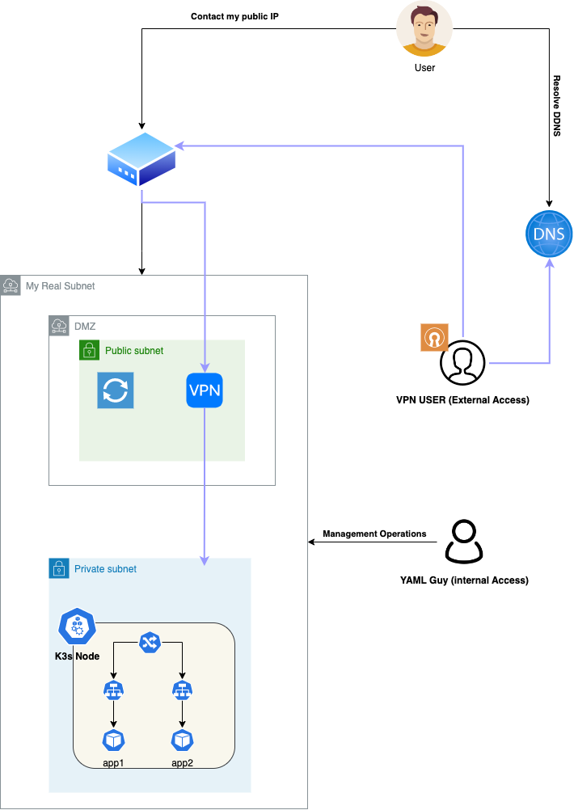

___
## 2. CI/CD

In this phase I'm going to create a CI/CD pipeline that will build our Docker containers and push the related images to a Registry container. There will also be image vulnerability checks in between

### 2.0 Keep your code base clean

If we want our code base to be clean and maintainable, we need to prevent badly formatted code from reaching it. We add a pre-commit hook to check yaml farmatting and other common errors.

```yaml
repos:
- repo: https://github.com/pre-commit/pre-commit-hooks
  rev: v2.3.0
  hooks:
  - id: check-yaml
    exclude: helm/templates/
- repo: https://github.com/gruntwork-io/pre-commit
  rev: v0.0.9
  hooks:
  - id: helmlint
- repo: https://github.com/dnephin/pre-commit-golang
  rev: master
  hooks:
    - id: go-fmt
    - id: go-vet
    - id: go-lint
    - id: go-imports
    - id: go-cyclo
      args: [-over=15]
    - id: validate-toml
    - id: no-go-testing
    - id: golangci-lint
    - id: go-critic
    - id: go-unit-tests
    - id: go-build

```

### 2.1 Build and deploy image locally

Let's start by building our images locally to figure out what we're dealing with

```docker build -t hecha00/app1:1.0 .```

Just a base Nginx container with a custom ```/location``` at path ```ping```

We can run it and curl on localhost

```docker run --env-file production.env -p 80:80 hecha00/app1:1.0 ```

Same thing for the second container.

The image is unnecessarily large and the Nginx version too old, it will surely be subject to CVE, we can see this with a sample ```docker scan [image_name]```

### 2.2 Create a pipeline to build image

We'll use GitHub Actions to get straight to the point.

For each push that modifies the files in samples/app1 or samples/app2 we will create a new image

I won't go into the details of how I connected the GitHub Actions to my Docker Hub account, for more info you can read my [article](https://ettoreciarcia.com/posts/01-iac-and-pipeline-my-personal-website/#32-authenticate-github-actions-against-aws). Did I mention I wrote an article? :)


**In this case I'm treating the project as a monorepo**, so I don't want all the pipelines to start with every push on the main branch.
We discriminate pipeline launch only to changes in the folders involved in the container build
We can do it in the following way:

```yaml
name: build app1
on:
  push:
    branches:
      - main
    paths:
      - samples/app1/**
  pull_request:
```

### 2.3 Add security scan image step in pipeline

For this purpose we will use a plugin present in the GitHub Marketplace

```yaml
      - name: Build an image from Dockerfile
        run: |
          docker build -t docker.io/hecha00/app1:${{ github.sha }} samples/app1
      - name: Scan Docker Image
        uses: aquasecurity/trivy-action@0.8.0
        with:
          image-ref: 'docker.io/hecha00/app1:${{ github.sha }}'
          format: 'table'
          exit-code: '1'
          ignore-unfixed: true
          vuln-type: 'os,library'
          severity: 'CRITICAL,HIGH'
```

We have configured our pipeline in such a way that there is an exit code of 1 in case the vulnerabilities found are HIGH or CRITICAL.

Let's go for a run!

As we suspected, our pipeline failed because the images from which the Dockerfiles start are old and vulnerable

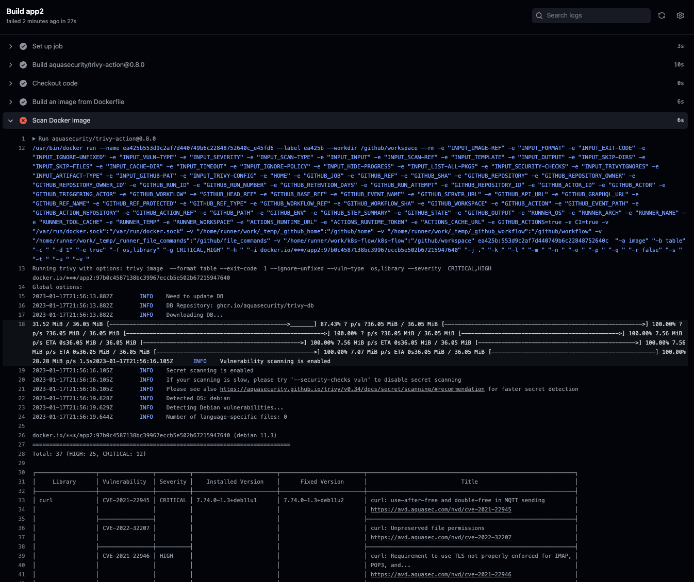

Image scanning in our pipeline found 37 vulnerabilitiesof **(HIGH: 25, CRITICAL: 12)**
In reality there are many other vulnerabilities but less impactful from a security point of view.

### 2.4 Optimize image size and security

These images aren't just devilish, they're way too big! 134MB for a container with plain nginx?

Let's try using a newer and lighter nginx image, **1-alpine-slim**.
(It Weighs only 4.77MB!)


But why should we do it?
In the end, one image is as good as another, as long as it works! No?
The size of the Docker images, in certain scenarios, avalanches on all components and in the long run the price you pay is high.
Here are some consequences of having unnecessarily heavy container images
- They take longer to build, this translates into pipelines that take longer to finish and therefore a worse **developer experience**
- Image repositories have costs related to the space we occupy. Larger images -> **Higher storage costs**
- They take longer to launch, in a highly scalable ecosystem where pods are destroyed and created all the time, **this makes the Kubernetes cluster less responsive**
- They take up more memory space once they are running, **this reducing cluster resources that we could dedicate to something else**
- The larger the image, the greater the attack surface for attackers.
This results in **security issues**


Want to learn more about how to reduce the size of container images? Read my personal wiki [Minimal Docker images](https://github.com/ettoreciarcia/homelab-learning/tree/main/Kubernetes/Paper/smaller-image-docker)

### 2.5 Push image on a container registry

Here we go, our pipeline built the Docker images and then pushed the images to our repository after verifying that they have no known vulnerabilities

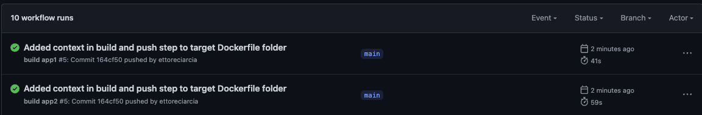

In this case we have created multi-architecture images, they can run on both amd and arm architectures.

We can take a look at our beautiful image on Docker Hub

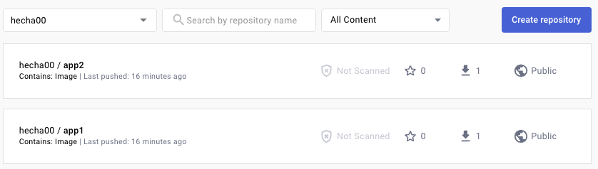

Everything is ready, we can finally enjoy Kubernetes

___
### 3. **Deploy**

### 3.1 Write Kubernetes manifest

**These manifests are only intended to port the application to kubernetes and have a skeleton to build the helm from**
In a first step we distribute the images by hand to make sure everything is ok and that the right environment variables are passed, in a second step we proceed with elmizing the solution.

For the deployment on Kubernetes let's generate the manifest of the 2 deployments:

```yaml
apiVersion: apps/v1
kind: Deployment
metadata:
  namespace: app1
  labels:
    app: app1
  name: app1
spec:
  replicas: 1
  selector:
    matchLabels:
      app: app1
  strategy: {}
  template:
    metadata:
      labels:
        app: app1
    spec:
      containers:
      - image: hecha00/app1:1.0
        name: app1
        env:
        - name: APP_NAME
          value: app1-production
        - name: COUNTRY
          value: us
        resources: {}
```

### 3.2 Add networking layer to our manifest
Then we expose the Pods internally to the cluster by creating a ClusterIP type Service:

```yaml
apiVersion: v1
kind: Service
metadata:
  name: app1-svc
  namespace: app1
spec:
  selector:
    app: app1
  ports:
    - port: 80
      targetPort: 80
  type: ClusterIP
```

In the example I have reported only the info relating to the first application. We can follow the same steps also for the deployment of the second application

From now on, our set of pods will be accessible within the cluster via the service, so we can ```curl``` on the service to the path of interest by building the host with the syntax ``` [SERVICE_NAME].[NAMESPACE]``` (Wouldn't serve the ```.[NAMESPACE]``` if you were in the same namespace)

Example from one of the pods related to app1
```curl app1-svc.app1/ping```

### 3.3 Expose applications using Nginx Ingress Controller

We expose the application using two Cluster IP services and place them behind an ingress controller, then we're going to edit our etc/hosts file to make sure everything went fine

```yaml
apiVersion: networking.k8s.io/v1
kind: Ingress
metadata:
  name: ingress
  namespace: we-road
spec:
  rules:
    - host: app1-it.info
      http:
        paths:
          - path: /
            pathType: Prefix
            backend:
              service:
                name: app1-svc
                port:
                  number: 80
    - host: app2-it.info
      http:
        paths:
          - path: /
            pathType: Prefix
            backend:
              service:
                name: app2-svc
                port:
                  number: 80
```

Now, after editing our ```/etc/hosts``` file with following line

```[RASPBERRY_PI_IP] app1-it.info```

we  can make a call to the host

```curl app-it.info```

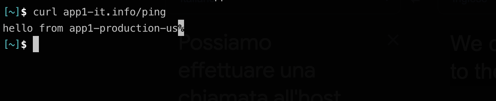

### 3.4 Expose RaspberryPi in DMZ

Following the philosophy of "Make it work, then make it beautiful" I first exposed the Raspberry Pi in the DMZ to test a functional first round
If you want to make calls to the services just exposed on the raspberry but from the public network you can search for the IP address of ```hecha.homepc.it``` (My DDNS)  and save it in your ```/etc/hosts``` file as we did in the previous step.

So, to retrieve my public you can run:
```dig hecha.homepc.it```

And then copy this value in your ```/etc/hosts``` file

```[MY_PUBLIC_IP] app1-it.info```

### 3.4 Add HPA


We're on Kubernetes so we like it barefoot, right? Let's add limits and resource requests to our pod. 
We know that a resting nginx pod consumes about 5Mi of RAM and 3M of CPU.

```yaml
containers:
      - image: hecha00/app1:1.0
        resources:
          limits:
            memory: "40Mi"
            cpu: "40m"
          requests:
            memory: "20Mi"
            cpu: "20m"
```

and let's create an HPA

```yaml
apiVersion: autoscaling/v2
kind: HorizontalPodAutoscaler
metadata:
  name: my-deployment-hpa
  namespace: we-road
spec:
  maxReplicas: 10
  metrics:
  - resource:
      name: cpu
      target:
        averageUtilization: 80
        type: Utilization
    type: Resource
  minReplicas: 1
  scaleTargetRef:
    apiVersion: apps/v1
    kind: Deployment
    name: app1
```

What we are telling our cluster with these definitions is that it should scale the pods in this deployment up to a maximum of 10 and should add a pod every time the cpu values ​​get close to 80% of the limit defined here

### 3.5 Replace our manifest with Helm chart

Created the skeleton of the manifests, I parameterized some values ​​by setting up a hellm chart, here is an extract that creates the depoyments

- Example of ```values.yaml```

```yaml
firstApp:
  create: true
  appName: app1
  env: staging
  countries:
  - it
  - es
  - uk
```

- Example of Deployment
```yaml
{{- if .Values.firstApp.create }}
{{ $appName := .Values.firstApp.appName }}
{{ $environment := .Values.firstApp.env }}
{{- range $country := .Values.firstApp.countries }}
apiVersion: apps/v1
kind: Deployment
metadata:
  namespace: we-road-{{ $country}}
  labels:
    app: {{ $appName }}-{{ $country}}
  name: {{ $appName }}-{{ $country}}
spec:
  replicas: 1
  selector:
    matchLabels:
      app: {{ $appName }}-{{ $country}}
  strategy: {}
  template:
    metadata:
      labels:
        app: {{ $appName }}-{{ $country}}
    spec:
      containers:
      - image: hecha00/{{ $appName }}:1.0
        name: {{ $appName }}-{{ $country}}
        env:
        - name: APP_NAME
          value: {{ $appName }}-{{ $environment }}
        - name: COUNTRY
          value: {{ $country }}
        resources: {}
status: {}
---
{{- end }}
{{- end }}
```

The complete helm chart can be found [HERE](helm)

**Install:**

```helm install release helm -f helm/values-prod.yaml```

**Upgrade:**

```helm upgrade release helm -f helm/values-prod.yaml```

**Uninstall:**

```helm uninstall release```

### 3.6 **GitOps Flow using ArgoCD**

Once you have installed the necessary manifests to dpeloy the argocd resources we can expose argo-server svc via port-forward

```k port-forward svc/argocd-server 8080:443 -n argocd```

Now we can access ArgoCD Web UI from localhost

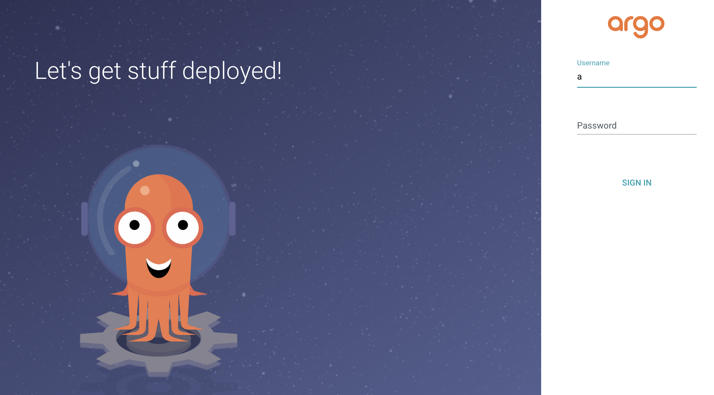

To retrieve ArgoCD's first password:

```kubectl -n argocd get secret argocd-initial-admin-secret -o jsonpath="{.data.password}" | base64 -d; echo```

After a bit, we create our application in argo and we linked it to our GitHub Repo!

```yaml
apiVersion: argoproj.io/v1alpha1
kind: Application
metadata:
  name: we-road
spec:
  destination:
    name: ''
    namespace: ''
    server: 'https://kubernetes.default.svc'
  source:
    path: helm
    repoURL: 'https://github.com/ettoreciarcia/k8s-flow'
    targetRevision: HEAD
    helm:
      valueFiles:
        - values-prod.yaml
  project: default
  syncPolicy:
    automated:
      prune: true
      selfHeal: true
    syncOptions:
      - CreateNamespace=true

```

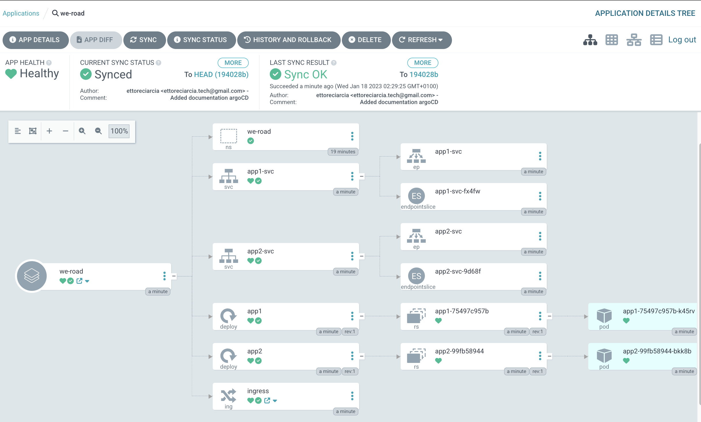

___

## 4. Scripting

### 4.1 **Create deploy-script**

For the script I chose to use the Cobra library.

The purpose of this application is to generate a file to feed to helm for the creation of our resources


This script imposes the following constraints on the inserted data

- Countries cannot be longer than two letters
- The project name cannot be different from app1 or app2
- The environment cannot be different from production or staging

You can see a demo here:

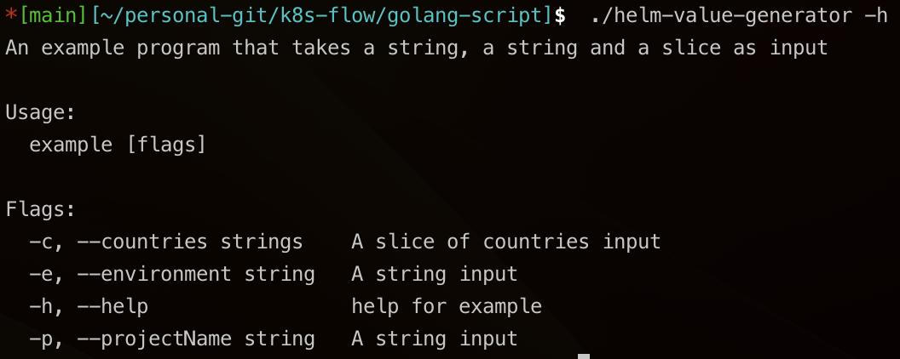


We can then run the command

```./helm-value-generator -c it,is -p app2 -e staging```

And a file will be created which contains the values ​​we specified

```yaml
secondApp:
  create: true
  appName: app2
  env: staging
  countries:
  - it
  - is
```

### 4.2 Write a golang application to export nginx logs at path /logs

With the current configuration nginx writes the logs only to stdout, to close this point I should change the nginx configuration so that the logs are saved to file

```shell
http {
    include       /etc/nginx/mime.types;
    default_type  application/octet-stream;

    log_format  combined_realip  '$http_x_forwarded_for - $remote_user [$time_local] "$request" '
                                 '$status $body_bytes_sent "$http_referer" '
                                '"$http_user_agent" "$http_x_forwarded_for"';

    sendfile        on;
    #tcp_nopush     on;

    keepalive_timeout  65;

    #gzip  on;

    include /etc/nginx/conf.d/*.conf;
}
```

And I would have added the directive

```access_log /var/log/nginx/access.log main;```

 in the server block.

Then I would read that file with a go or python program and make the logs available via http on a port

I see two problems in my approach:
- Port 80 would already be busy
- The file would keep changing and I don't think the nginx /logs page would update as the file changed without a nginx reload
___

## 5. Logging & Monitoring

### 5.1 Prometheus and Grafana


To monitor the cluster I chose Prometheus and Grafana with a simple configuration (I don't scrape custom metrics).


The only change I made was to change the Promethes and Grafana services from ClusterIP to NodePort so they were directly accessible on my Raspberry Pi's IP

```kubectl -n monitoring port-forward svc/grafana 3000```

Here some intersting dashboard

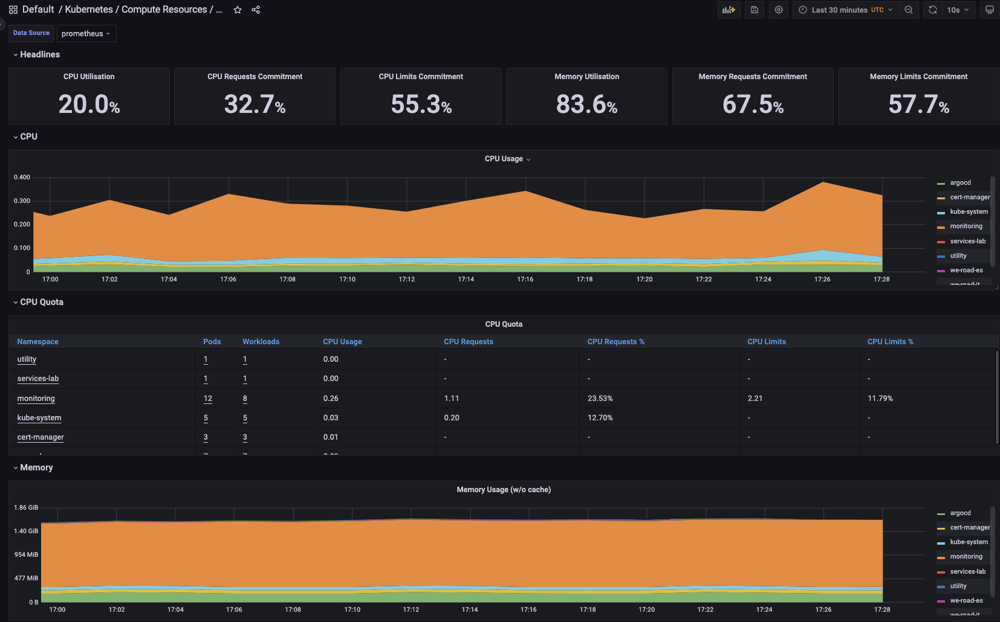

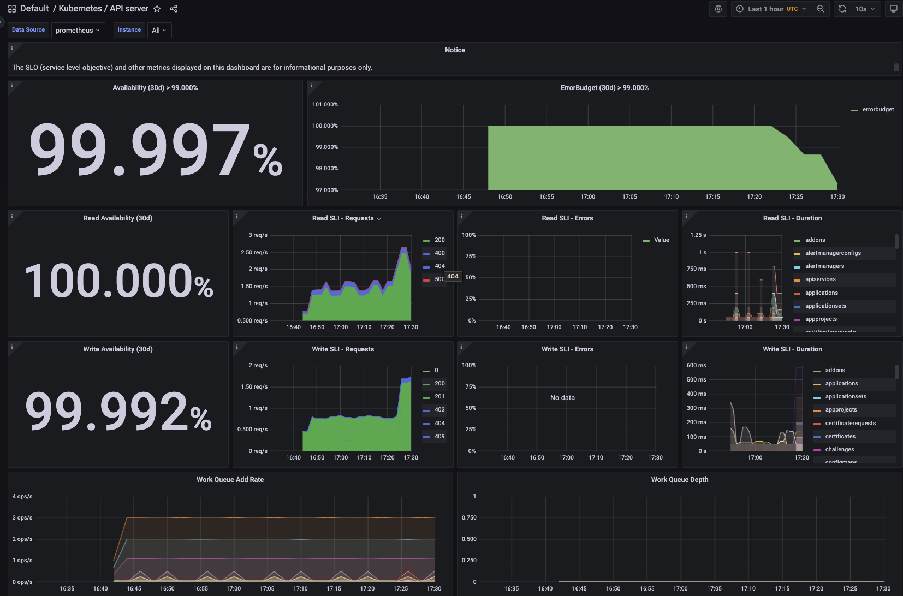

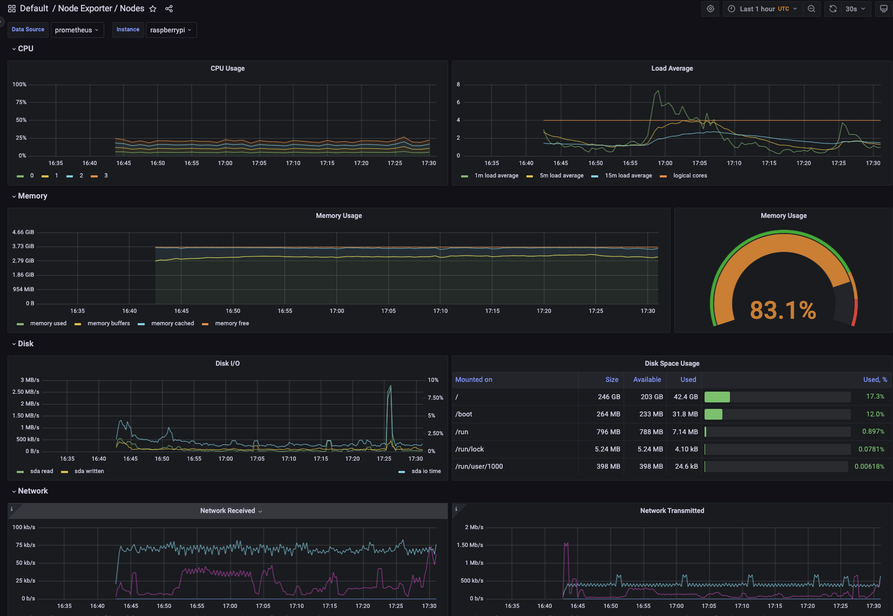

Yeah, my RaspberryPi is about to explode!
___

## 6. Load test & Autoscaling Considerations

In the previous step we set limits on the resources that the application pods can consume. It's time to put some stress on the application with a load test.


For this goal we will use [locust](https://locust.io/), a modern load testing framework.

We will define a locustfile structured like this

```python
from locust import HttpUser, task, between

class QuickstartUser(HttpUser):

    @task
    def sample_call(self):
        self.client.get("/")
        self.client.get("/ping")
```

And now we see the magic


___

## 7. External Access

### 7.1 **Grant external access to private subnet with VPN**

I made it possible to reach my VPN server by creating an .ovpn file for each user who needed it